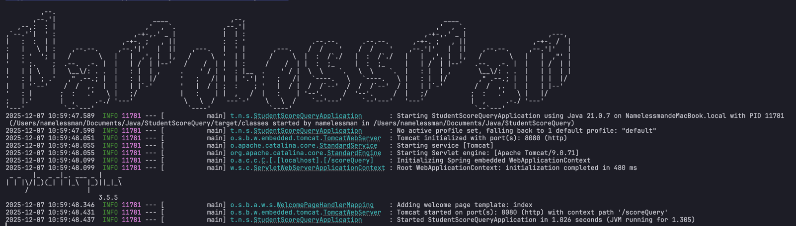
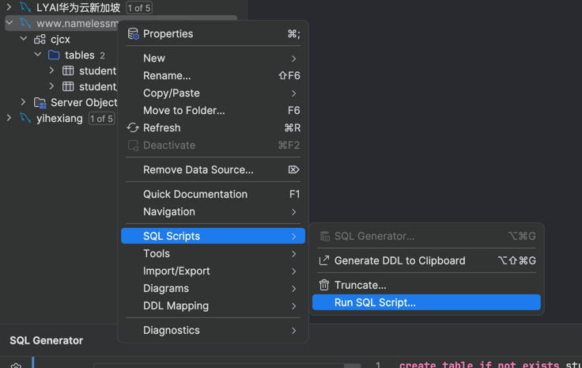
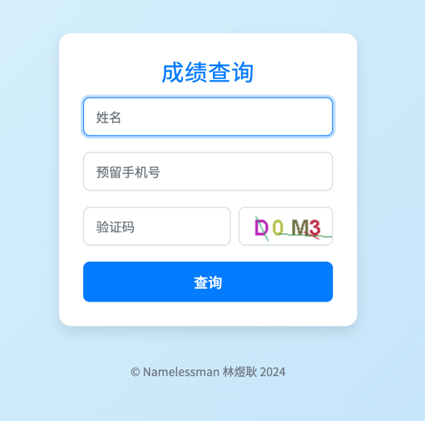
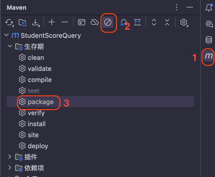
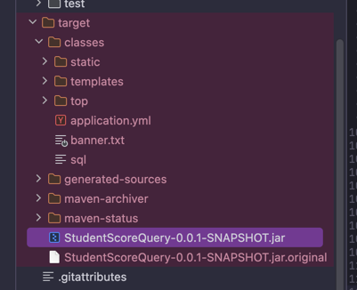
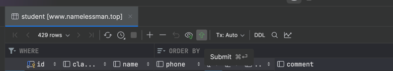

# 编程班学生成绩查询系统

> by `Namelessman`

## 环境

- IDE `IDEA`
- Java环境 `Java 17+`
- 数据库 `MySQL`
- 数据库可视化操作 `DataGrip`
- 反向代理(可选) `Nginx`
- 科学上网

## 部署说明

### 本地部署运行

#### 0. 配置环境

##### 0.1 按照环境要求安装好相关环境

##### 0.2 克隆本项目并用idea打开

##### 0.3 点击运行按钮将项目跑起来

打印以下内容（最后两行）则表示启动成功，说明Java环境和依赖配置无误



#### 1. 导入数据库表

在DataGrip中执行`src/main/resources/sql`的sql，会自动创建数据库和表


#### 2. 修改配置文件

- 数据库

```yml
spring:
  datasource:
    url: # mysql的url
    username: # 用户名
    password: #密码
```

url可参考以下：

```
jdbc:mysql://域名或ip:3306/cjcx?serverTimezone=Asia/Shanghai&useUnicode=true&characterEncoding=utf-8
```

- 服务端口

```yml
server:
  port: 8080
  servlet:
    context-path: /scoreQuery
```

使用以上配置，访问服务需要：
`域名或ip:8080/scoreQuery`

如果使用nginx，可以在nginx将/scoreQuery代理到8080/scoreQuery，实现外部用http或https的默认端口访问

如果不使用nginx，可以直接将port改为80，如果有ssl证书，可以改为443并配置ssl的相关配置

- 学生作品保存路径
```yml
file:
  download:
    path: /root/xszp2 
```

学生下载作品会在这个路径下查找`姓名.sb3`的文件，**暂时没有处理同名情况**。

#### 3. 导入测试数据

执行以下sql语句

```sql
INSERT INTO cjcx.student (class_name, name, phone, final_score, usual_score, total_score, comment, is_checked, feedback, teaching_class_name) VALUES ('一（1）班', '测试', '13144170000', 'B', 'A', 'B+', '你是一个活泼聪明的孩子，你在课堂上能够遵守纪律，完成老师交代的任务，非常棒！你的作品完成度还有很大的提升空间哦，你添加了许多角色，但没有编程实现功能呀。希望你能运用我们课堂上学习的编程知识，做出更完善的作品。继续努力！', 0, null, '25春 实验小 周三');

```

#### 4. 运行并测试
重新运行项目，显示
```txt
Tomcat started on port(s): 8080 (http) with context path '/scoreQuery'
```
后打开浏览器，访问`localhost:8080/scoreQuery`



输入姓名`测试`，预留手机号`13144170000`，输入验证码，点击查询，可以正确查询则表示以上配置均无误


### 服务器部署

建议在本地部署跑通后，再进行服务器部署。

**服务器也需要安装Java、MySQL、Nginx(可选)环境**

确认配置文件无误（即端口、作品保存路径、MySQL的url等等符合服务器需要的配置）进入以下步骤

#### 1. 服务器完成MySQL的“导入数据库表”一步


#### 2. 打包

在IDEA，右边工具栏里：



双击3进行打包

（后续修改了代码就需要重新打包）

打包完毕后，项目文件夹下会出现`target/StudentScoreQuery-0.0.1-SNAPSHOT.jar`文件

服务器操作中建议用root用户，否则对于新生容易出现权限问题



#### 3. 上传服务器
将`target/StudentScoreQuery-0.0.1-SNAPSHOT.jar`文件上传到服务器

#### 4. 启动服务
在上传后的StudentScoreQuery-0.0.1-SNAPSHOT.jar所在目录下，执行

```shell
java -jar StudentScoreQuery-0.0.1-SNAPSHOT.jar
```

观察日志，判断是否正常运行，方法与本地部署0.3一步相同

#### 5. 导入测试数据和测试
同本地部署，url改成服务器的ip或域名

如果日志显示正常运行，但浏览器无法访问，在网址无误的情况下，大概率是防火墙和安全组问题

可能要到服务器控制台安全组里开放使用的端口，并在服务器中的防火墙开发使用的端口

如果查询无误，则进入下一步

#### 6. 持续运行

将刚刚运行的会话强制停止，快捷键`ctrl+c`

使用以下命令

```shell
nohup java -jar StudentScoreQuery-0.0.1-SNAPSHOT.jar
```

等待一会，重新访问，如果正常查询，则部署完毕

此时可以关闭ssh会话，但不要ctrl+c，这样服务就能够持续运行


#### 7. 关闭或重启


如果执行`nohup java -jar StudentScoreQuery-0.0.1-SNAPSHOT.jar`后，无法访问，或修改了代码需要重新启动，则需要先杀死正在运行的服务，再重新启动

执行

```shell
lsof -i:端口
```

会打印出pid，如果没有打印，没有找到pid，则跳过下一步。

执行

```shell
kill -9 pid
```

然后即可使用第4或第6步来重新运行服务。


## 成绩数据录入

导入数据在DataGrip中操作，数据的粘贴，修改与excel非常类似，可以从excel复制并粘贴到DataGrip

修改数据后，要点击提交按钮同步到数据库



将学生的作品文件按照`姓名.sb3命名，放入配置的学生作品保存路径文件夹，即可供学生下载作品。

## 后台

后台网址`http://域名或ip:8080/scoreQuery/admin?password=Fucku_bug`

该网址供教师使用，勿发给学生

## 关于安全问题

成绩查询接口通过姓名+预留手机号防止查询非本人成绩，但留言接口、下载作品接口未做任何鉴权。

也就是存在冒充他人留言、下载他人作品的漏洞。

后台网址password=Fucku_bug参数只是为了防止基本的路径遍历，没有真实的“密码”语义，没有登录态。

但是，攻击者通过该系统并无法篡改学生成绩、学生作品，因为后台没有成绩录入功能（笑）。

务必妥善保管服务器密码和数据库密码。